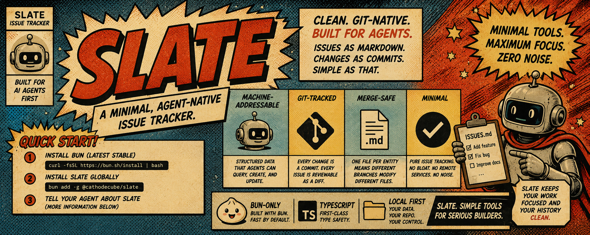

<div align="center">
  
</div>

---

A minimal, agent-native issue tracker.

Slate replaces clunky issue-tracking tools with a clean CLI, a first-class library, and git-friendly markdown files — designed for AI agents first, humans second.

## Why Slate

Most issue trackers are built for human workflows: sprints, epics, burndown charts, and JIRA-ness. AI agents need something different:

- **Machine-addressable** — structured data that agents can query, create, and update programmatically.
- **Git-tracked** — every change is a commit, every issue is reviewable as a diff.
- **Merge-safe** — one file per entity means different branches modify different files with zero cross-entity conflicts.
- **Minimal** — pure issue tracking. No bloat, no dependencies on remote services.

## Quick Start

> **Bun-only.** Slate requires Bun to run. It uses native Bun TypeScript resolution and does not support Node.js. Install [Bun](https://bun.sh/) (v1.0.0 or later) before proceeding.

- Install [Bun](https://bun.sh/) (latest stable)
- Install slate globally with: `bun add -g @cathodecube/slate`
- Tell your agent about Slate (More information below)

#### Configuring Your Agent

To teach your agent about Slate, add the following to your project's `AGENTS.md`:

````markdown
## Slate — Project Issue Tracking

This project uses [Slate](https://github.com/) for issue tracking. Slate stores PRDs and tasks as git-tracked markdown files under `slate/`.

**When to use Slate:** Anytime a task, issue, feature, or bug needs to be tracked — before writing code, during implementation, or when planning next steps.

**How to learn Slate's commands:**

```bash
slate overview
```

Run this command to get a full overview of available commands. The output includes examples for creating PRDs and tasks (including multi-line bodies via stdin), listing tasks, updating status, and finding the next actionable task.

**Key workflow:**

1. `slate init` — Initialize the `slate/` directory if not already done.
2. `slate prd create --title "..."` — Create a PRD for the feature.
3. `slate task create --title "..." --prd <prd-id> --priority high <<EOF` — Create a task with a detailed body.
4. `slate plan` — Find the next actionable task.
5. `slate task update <id> --status in-progress` — When starting work.
6. `slate task update <id> --status done` — When finished.
````

## Slate In Your Project

```
your-project/
  slate/
    prds/           # PRD files (one per PRD)
      prd-001.md
    tasks/          # Task files (one per task)
      task-001.md
```

Each entity is stored as a Markdown file with YAML frontmatter:

```markdown
---
id: task-001
title: Implement CLI parser
status: todo
priority: high
dependencies: []
prd: prd-001
created: 2026-05-12
updated: 2026-05-12
---

Notes go here.
```

#### Core Concepts

| Term | Description |
|------|-------------|
| **PRD** | A Product Requirements Document — a named collection of tasks that define a feature or initiative. |
| **Task** | The fundamental unit of work. Has a status, priority, dependencies, and optional PRD binding. |
| **Status** | One of: `todo`, `in-progress`, `done`, `blocked`. |
| **Priority** | One of: `high`, `medium`, `low`. |
| **Dependency** | A task can depend on other tasks by ID. A task is actionable only when all its dependencies are `done`. |

## CLI Usage

Slate is mainly intended to be used by AI agents, which will call this CLI. Of course it is possible to invoke the CLI manually too.

```bash
# Create a PRD
slate prd create --title "My Feature"

# Create a task under that PRD (body via stdin)
echo "Implement the CLI parser with arg parsing." | slate task create --title "Implement CLI parser" --prd <prd-id> --priority high

# Body is optional — a task with just a title is valid
slate task create --title "Quick note" --priority low

# List all tasks
slate task list

# Update a task status
slate task update <task-id> --status in-progress

# Close a task
slate task update <task-id> --status done
```

## Library Usage

Slate exposes a library for programmatic access, enabling agentic harness extensions to call it directly:

```typescript
import { Slate } from "@cathodecube/slate";

const slate = new Slate({ dir: "./slate" });

// Create a task
const result = await slate.tasks.create({
  title: "Implement CLI parser",
  priority: "high",
  prd: "prd-001",
});

// Query tasks
const actionable = await slate.tasks.query({
  where: { status: "todo" },
  filter: (task) => task.dependencies.every((id) => slate.isDone(id)),
});
```

## Changelog

See [CHANGELOG.md](./CHANGELOG.md) for release notes.

## Roadmap

See [ROADMAP.md](./ROADMAP.md) for the phased feature plan.

## Domain Context

See [CONTEXT.md](./CONTEXT.md) for the full domain context and design decisions.
